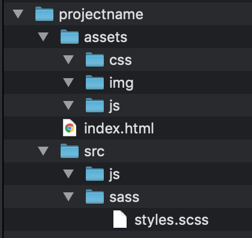

# Setting Up a New Project

This readme file provides the steps for creating a basic website project that will allow you to use gulp.js v4 along with:
- **gulp-sass**: converts scss files to css
- **postcss**: provides a way to analyze and modify css rules (needed to use both autoprefixer and cssnano)
- **autoprefixer**: prefixes css rules with browser prefixes that help make your css work in a broader number of environments
- **cssnano**: minifies your css
- **rename**: allows you to rename files, such as adding .min to a file extension when a file is minified
- **babel.js**: transpiles (converts) modern ES6 code to an older syntax making it possible to run on more browsers
- **uglify**: minifies your js

## Summary of Steps

These instructions will cover each of the steps below:

1. Create a new project folder with folders for source and "compiled" files.
2. Initialize the project for git and create a basic .gitignore file.
3. Initialize the project for use with node modules (creating package.json file).
4. Install gulp for use with the project and save it to the devDependencies in the package.json file.
5. Create a gulpfile.js file, where we'll add our gulp code.
6. Install all of the gulp plugins described above and save them to the devDependencies in the package.json.
7. Create a basic gulp workflow for watching, compiling/transpiling, minifying and serving js and sass files.

### Create a Project Folder

We need a project folder to hold all of our files.  It needs a structure that's a little different from the one we've been using so far.  It will look like this when you've completed these steps:

You can create this folder/file structure manually, or you can use the command line to do it.  Let's open up Terminal on the MAC and do this the pro way:

1. Open Terminal (find it in the Applications > Utilities folder or use Spotlight to search for it). 
2. When a new Terminal window opens, you should be in your user home directory by default.  You can confirm this by typing `pwd`, which is the command used in Terminal to display the current working directory.  If you're not in your /Users/*yourusername* directory, just type `cd ~`.  The **cd** is the command to *change directory* and the tilde tells it to change to your home directory. 
3. We're going to put the project folder, which I'll name exampleproj, on the desktop, so type: ` mkdir -p ~/Desktop/exampleproj`. The **mkdir** command means *make directory* and the part that follows is the path and name of the folder we want to create.  Remember, the ~ means start in your home directory.  (We're already in the home directory, so we could have skipped the tilde and forward slash, but we're practicing so that we get used to using it. :smile:). When you see one or more letters preceded by a hyphen used in a Terminal command, we call that a flag.  The p flag (`-p`) used with the mkdir command means create any folder(s) in the path that don't exist. If you had typed `mk dir -p ~/Desktop/mysites/newproj` for example, and there wasn't a mysites folder already on the desktop, it would have created both the mysites folder and the nested newproj folder. 
4. Next, type `cd !$`.  The **!$** is another one of those special commands we can give to change directory.  It will take us into the folder we just created. 
5. From here we need to build our project folders.  We could do these one at a time by using our `mkdir` command, but we can make several folders all in one command by wrapping them in curly braces like this: `mkdir -p assets/{css,img,js} src/{js,sass}`.   The **mkdir** command allows us to make multiple folders with a single command by placing a space between the folder names.  Additionally, we can use the curly braces to wrap multiple nested folders.  With this syntax, anything inside the curly braces is separated by a comma. 
6. You can check your handy work so far with `ls` command. The **ls** stands for *list* and it will lists all of the files in the folder.  You should see that you have two top level folders named assets and src now in the project folder, and if you cd into the assets folder with `cd assets` and then type `ls`, you'll see the 3 folders we created there as well.  Use `cd ..` to go back one directory so you're in your project folder.  Remember, you can type `pwd` at any time to find out where you're at inside your directory structure.  This is a lot of work to check out our folder structure though, so we can use another command borrowed from Linux to show the entire tree view of our directory right in the Terminal.  Unfortunately, the tree command doesn't come native with MAC OS, but it's easy enough to install with `sudo port install tree` (or if you have Homebrew installed you can type `brew install tree`).  We'll learn more about what **sudo** is in a bit, but in the meantime, just know that it will prompt for a password (use the one you use to login to your machine) before it installs the tree command for you.  Once tree is installed, you can type `tree -d -L 2`. The **tree** command is being used here with some flags to limit our results.  The d flag tells it to only display folders and ignore any files.  The L flag is for limiting the number of levels to display.  In this case we're only showing 2 levels deep.  Another helpful flag is the `--filelimit` flag followed by the number of folders we want to show in any given directory.  By the way, in case you're curious why some flags have a single hyphen and other have two, like this filelimit flag, it has to do with the fact that single character flags can be written in a shorthand format joined together following a single hyphen (e.g., `tree -dtL 2` is the same as `tree -d -t -L 2`). As a result, flags that have more than one character in their name have to be preceded with two hyphens or the computer would interpret them using the shorthand rules (i.e., `-filelimit` would be interpreted as `-f -i -l -e -l -i -m -i -t`).
7. Next, we're going to create an index.html file in the root of our project.  Once you're back in the project folder, type `touch index.html`.  I know -- it's a creepy sounding command, but it just means *if this file doesn't exist, create it*.
8. We're going to use touch once more now to create our sass file, so type `touch src/sass/styles.scss`.

Go check out your work by opening the folder you created on the Desktop using Finder and perusing everything you did with just the command line!!!! :tada:

### Initialize the Project for Git

1. We're going to want to use git for our project, so to initialize the folder, we just need to make sure we're in our project folder by typing `pwd`.  If you need to, cd into the correct folder with `cd ~/Desktop/exampleproj`.  Once there, type `git init`.  You should get back a message that reads: **Initialized empty Git repository in /Users/yourusername/Desktop/test/.git/**.
2. That's really it, but since we're going to have a lot of special files in here for gulp to work with, we want to make sure to exclude them automatically when we upload stuff to GitHub.  We can do that with a special file called a **.gitignore** file.  This file just contains a list of files we don't want git to bother with tracking or syncing to our GitHub account, such as those weird .DS_Store files you may have seen show up in your GitHub account.  One easy way to create this file is to use our touch command again.  So, type `touch .gitignore` in the root of the project.
3. We're going to add some stuff to this file by opening it in our Atom text editor by typing: `atom .gitignore`.
4. Next, copy the .gitignore contents in this directory and paste it into your file that is open in Atom.  Save it and close it.  There are several ways to get good starting boilerplate.  I use a site maintained by the folks at Git called: https://www.gitignore.io/.  You can go there and manually generate the file contents, or you can use a special package like wget that allows you to use the command line to retrieve files over the Internet.

Now, you've got your project set up to use git locally.  When you want to connect to GitHub, you can just open up your GitHub Desktop program and go to File > Add Local Repository..., find the folder and click Add Repository.  To add a corresponding GitHub remote repository, just commit your files and click the Publish button.

# Initialize the Project for Use with Node

You already have Node.js installed. We did that to get the Browsersync server installed on your computer in one of our classes.  Node.js is pretty powerful and offers a lot more than just the option to run a web server.  Node.js *is* actually a server. Specifically, it's a server that runs Javascript (except without a browser). Many people have written open source projects (called modules) that run on the Node.js server -- over 350,000 as a matter of fact.  This is great if we're creating a web project because we can take advantage of many of these node modules to improve our code; simplify our workflows; and even build sophisticated backends for our site.

This is where npm comes into play.  The Node Package Manager, known as npm, is a tool that lets us easily install and manage any of those 350,000 node modules that people have built and shared with the rest of the world.  Again, we've already installed npm.  You can verify that by typing `npm -v` in the Terminal.  This command will tell you what version of npm is installed on your machine.

To use Node.js and npm on our project, we need to have a package.json file. A package.json file is a manifest of your project that describes the packages and applications it depends on, information about its unique source control (like Git), and specific metadata like the project's name, description, and author.  You can create this file manually.  All it is is a JSON formatted document, but it's picky about the format and doing that is tedious, so we can use the npm init command to do it for us:

1. Use `pwd` or just type `cd ~/Desktop/exampleproj` to make sure you're in the project folder first.  Once you've made sure you're in the root folder for your project, type `npm init`.
2. This command will prompt you to answer a bunch of questions.  It will also provide you with useful defaults in parentheses.  You can accept all of the defaults and omit any values that don't have defaults.  The two value that are helpful to add/override though are for the entry point and the git repository.  We can update the file manually later, but it's just easier to set these up now.  The entry point for the project prompts you with a default of **(index.js)**.  Change this to `index.html`.  The git repository is blank, but since we initialized the project for git, we can type: `https://github.com/yourusername/yourprojectfolder` (in this case the project folder is going to be exampleproj).
3. When done, it will print out the results of the file it will create as the package.json and prompt you to type `yes` to accept the results.

### Install Gulp.js for Use in the Project

Now we're ready to install Gulp.js.  Gulp.js is a task runner.  Basically, it's a tool that has lots of plugins that we can link into one or more workflows that we can kick off with the **gulp** command.  These workflows can do things like open up our sass files and compile them into css, then add vendor prefixes to all of the css that needs it, then write it to a new folder in our project as minified file.  Each of those tasks: compiling, prefixing and minifying is done with a Gulp plugin.

1. To install Gulp.js locally for this project, we need to first install the Gulp CLI (command line interface).  We'll install this CLI globally on our machine so that we only need to do it once and can reuse it on any of our projects in the future.  The command to do this is `sudo npm install gulp-cli -g`. We're using sudo before this command because we're installing globally, that's what the -g flag says, and sudo means run this operation as the owner of this machine. It actually stands for *super user do*.  Because we used sudo, it will prompt us for the computer password that you use to login, just to be certain that you are authorized to install software on it.
2. After the cli is installed, we need to install Gulp.js into our project, so first make sure you're in the project folder with `cd ~/Desktop/exampleproj`, then type `npm install gulp -D`.  The npm install command is just like the one we just used except this one is only installing a local copy for the project so we don't need sudo.  The -D flag tells npm to update our package.json file by adding information about Gulp.js to the devDependencies.  This means that we only need Gulp.js when we're developing our website or app, but not later when we are running this project in production.
3. Next, we're going to use touch again to create a gulpfile.js, so type `touch gulpfile.js`.

### Install the Gulp Plugins for This project

There are hundreds of plugins available for Gulp.js.  We're only going to use a couple for this project.  The process for installing couldn't be simpler though and you can add other plugins later as you need them following the same process.

1. For this project we need to install a bunch of plugins for Gulp.js.  We're going to do this all in one line, but the basic format for installing any plugin is to type `npm install plugin-name -D`.  Remember, the -D flag is going to save all of the information about which npm modules we're using on our project.  For this project, let's load all of them in one shot.  To do this type:
`npm install gulp-sass autoprefixer cssnano gulp-postcss browser-sync -D`

### Create a Basic Gulp Workflow

The workflows for Gulp.js are defined in the gulpfile.js that we created earlier.  These are written in Javascript.  Gulp.js adds a couple of special methods to make this easier, the most important of which is the .pipe() method.

1. Copy the contents of the gulpfile.js from this site to your file.
2. Save the file and then add some boilerplate to the index.html.  This file should point to the assets folder css, img, and js folders.  This will be the output destination of our actions in Gulp.js. In this case, the styles will be output to assets/css/styles.css.
3. Add the scss file from this site to the src/sass folder and copy the contents of the index.html markup to the index.html in your project folder.
4. Go to the Terminal and type `gulp watch`.
5. Make a change the the styles.scss file and save it.  The gulp watch command we created will output a styles.css and reload the browser.

SUCCESS :tada:
